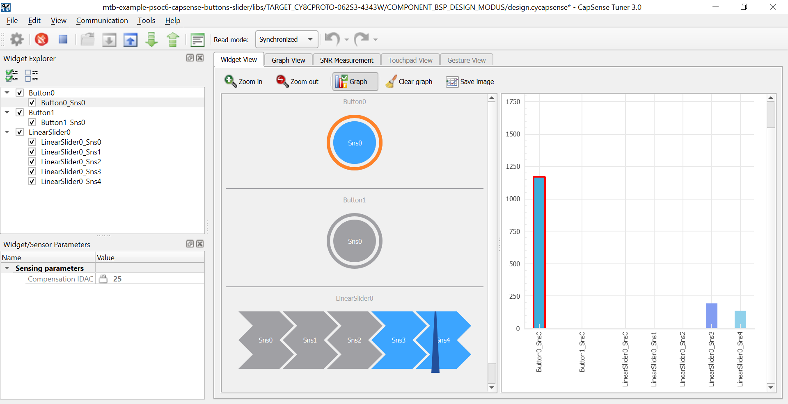

# PSoC 6 MCU: CapSense Buttons and Slider

This code example features a 5-segment CapSense® slider and two CapSense buttons. Button 0 turns the LED ON, Button 1 turns the LED OFF, and the slider controls the brightness of the LED. The code example also demonstrates monitoring CapSense data using the CapSense Tuner GUI tool. This project uses the [CapSense Middleware Library](https://github.com/cypresssemiconductorco/capsense).

## Requirements

- [ModusToolbox™ software](https://www.cypress.com/products/modustoolbox-software-environment) v2.1
- Programming Language: C
- Associated Parts: All [PSoC® 6 MCU](http://www.cypress.com/PSoC6) parts

## Supported Kits

- [PSoC 6 Wi-Fi BT Prototyping Kit](https://www.cypress.com/CY8CPROTO-062-4343W) (CY8CPROTO-062-4343W) - Default target
- [PSoC 6 WiFi-BT Pioneer Kit](https://www.cypress.com/CY8CKIT-062-WiFi-BT) (CY8CKIT-062-WIFI-BT)
- [PSoC 6 BLE Pioneer Kit](https://www.cypress.com/CY8CKIT-062-BLE) (CY8CKIT-062-BLE)
- [PSoC 62S2 Wi-Fi BT Pioneer Kit](https://www.cypress.com/CY8CKIT-062S2-43012) (CY8CKIT-062S2-43012)
- [PSoC 62S1 Wi-Fi BT Pioneer Kit](https://www.cypress.com/CYW9P62S1-43438EVB-01) (CYW9P62S1-43438EVB-01)
- [PSoC 62S1 Wi-Fi BT Pioneer Kit](https://www.cypress.com/CYW9P62S1-43012EVB-01) (CYW9P62S1-43012EVB-01)
- [PSoC 62S3 Wi-Fi BT Prototyping Kit](https://www.cypress.com/CY8CPROTO-062S3-4343W) (CY8CPROTO-062S3-4343W)

## Hardware Setup

This example uses the board's default configuration. See the kit user guide to ensure that the board is configured correctly.

**Note**: The PSoC 6 BLE Pioneer Kit (CY8CKIT-062-BLE) and the PSoC 6 WiFi-BT Pioneer Kit (CY8CKIT-062-WIFI-BT) ship with KitProg2 installed. ModusToolbox software requires KitProg3. Before using this code example, make sure that the board is upgraded to KitProg3. The tool and instructions are available in the [Firmware Loader](https://github.com/cypresssemiconductorco/Firmware-loader) GitHub repository. If you do not upgrade, you will see an error like "unable to find CMSIS-DAP device" or "KitProg firmware is out of date".

## Software Setup

This example requires no additional software or tools.

## Using the Code Example

### In Eclipse IDE for ModusToolbox:

1. Click the **New Application** link in the Quick Panel (or, use **File** > **New** > **ModusToolbox Application**).

2. Pick a kit supported by the code example from the list shown in the **Project Creator - Choose Board Support Package (BSP)** dialog.

   When you select a supported kit, the example is reconfigured automatically to work with the kit. To work with a different supported kit later, use the **Library Manager** to choose the BSP for the supported kit. You can use the Library Manager to select or update the BSP and firmware libraries used in this application. To access the Library Manager, right-click the application name from the Project Workspace window in the IDE, and select **ModusToolbox** > **Library Manager**. You can also access it from the **Quick Panel**.

   You can also just start the application creation process again and select a different kit.

   If you want to use the application for a kit not listed here, you may need to update the source files. If the kit does not have the required resources, the application may not work.

3. In the **Project Creator - Select Application** dialog, choose the example.

4. Optionally, update the **Application Name** and **Location** fields with the application name and local path where the application is created.

5. Click **Create** to complete the application creation process.

For more details, see the Eclipse IDE for ModusToolbox User Guide: *{ModusToolbox install directory}/ide_{version}/docs/mt_ide_user_guide.pdf*.

### In Command-line Interface (CLI):

1. Download and unzip this repository onto your local machine, or clone the repository.

2. Open a CLI terminal and navigate to the application folder.

   On Linux and macOS, you can use any terminal application. On Windows, navigate to the modus-shell directory (*{ModusToolbox install directory}/tools_\<version>/modus-shell*) and run *Cygwin.bat*.

3. Import the required libraries by executing the `make getlibs` command.

### In Third-party IDEs:

1. Follow the instructions from the [CLI](#in-command-line-interface-cli) section to download or clone the repository, and import the libraries using the `make getlibs` command.

2. Export the application to a supported IDE using the `make <ide>` command.

3. Follow the instructions displayed in the terminal to create or import the application as an IDE project.

For more details, see the "Exporting to IDEs" section of the ModusToolbox User Guide: *{ModusToolbox install directory}/ide_{version}/docs/mtb_user_guide.pdf*.

## Operation

1. Connect the board to your PC using the provided USB cable through the KitProg3 USB connector.

2. Program the board.

   - **Using Eclipse IDE for ModusToolbox**:

      1. Select the application project in the Project Explorer.

      2. In the **Quick Panel**, scroll down, and click **\<Application Name> Program (KitProg3)**.

   - **Using CLI**:

     From the terminal, execute the `make program` command to build and program the application using the default toolchain to the default target. You can specify a target and toolchain manually:
      ```
      make program TARGET=<BSP> TOOLCHAIN=<toolchain>
      ```

      Example:
      ```
      make program TARGET=CY8CPROTO-062-4343W TOOLCHAIN=GCC_ARM
      ```

      **Note**:  Before building the application, ensure that the *deps* folder contains the BSP file (*TARGET_xxx.lib*) corresponding to the TARGET. Execute the `make getlibs` command to fetch the BSP contents before building the application.

3. After programming, the application starts automatically. Confirm that the user LED is glowing.

4. To test the application, touch CapSense button 1 (BTN1) to turn the LED OFF, touch CapSense Button 0 (BTN0) to turn the LED ON, and touch the slider in different positions to change the brightness.

5. You can also monitor the CapSense data using the CapSense Tuner application as follows:

    **Monitor Data Using CapSense Tuner**

    1. Open *{ModusToolbox install directory}/ModusToolbox/tools_{version}/capsense-configurator/capsense-tuner* to run the CapSense Tuner application. 

    2. Select **File** > **Open** and open the *design.cycapsense* file for the respective kit, i.e., *<application_folder>/libs/TARGET_\<BSP-NAME>/COMPONENT_BSP_DESIGN_MODUS/design.cycapsense*. 

    3. Ensure the kit is in KitProg3 mode. See [Firmware-loader](https://github.com/cypresssemiconductorco/Firmware-loader) to learn on how to update the firmware and switch to KitProg3 mode.

    4. In the Tuner application, click **Tuner Communication Setup** or select **Tools** > **Tuner Communication Setup**. In the window that appears, select the I2C checkbox under KitProg3 and configure as follows: 

            I2C Address: 8
            Sub-address: 2-Bytes
            Speed (kHz): 400

    5. Click **Connect** or select **Communication** > **Connect**.

    6. Click **Start** or select **Communication** > **Start**.

    Under the **Widget View** tab, you can see the corresponding widgets highlighted in blue color when you touch the button or slider. You can also view the sensor data in the **Graph View** tab. For example, to view the sensor data for Button 0, select **Button0_Rx0** under **Button0**. 

    Figure 1 shows the CapSense Tuner displaying the status of CapSense touch on Button 0 and LinearSlider 0.

    **Figure 1. CapSense Tuner Showing Touch Data**
    

    The CapSense Tuner can also be used for CapSense parameter tuning, and measuring signal-to-noise ratio (SNR). See the [ModusToolbox CapSense Tuner Guide](https://www.cypress.com/ModusToolboxCapSenseTuner) (**Help** > **View Help**) and [AN85951 – PSoC 4 and PSoC 6 MCU CapSense Design Guide](https://www.cypress.com/an85951) for more details on selecting the tuning parameters. 

## Debugging

You can debug the example to step through the code. In the IDE, use the **\<Application Name> Debug (KitProg3)** configuration in the **Quick Panel**. For more details, see the "Program and Debug" section in the Eclipse IDE for ModusToolbox User Guide: *{ModusToolbox install directory}/ide_{version}/docs/mt_ide_user_guide.pdf*.

## Design and Implementation

In this project, PSoC 6 MCU scans a self-capacitance (CSD) based 5-element CapSense slider, and two mutual capacitance (CSX) CapSense buttons for user input. The project uses the [CapSense Middleware](https://github.com/cypresssemiconductorco/capsense) (see [ModusToolbox User Guide](http://www.cypress.com/ModusToolboxUserGuide) for more details on selecting a middleware). See [AN85951 – PSoC 4 and PSoC 6 MCU CapSense Design Guide](https://www.cypress.com/an85951) for more details on CapSense features and usage. 

In this application, the state of the user LED is controlled based on user inputs provided using the CapSense buttons and slider. A PWM HAL resource is configured for controlling the brightness of the LED. Touching Button 0 turns the LED ON, and Button 1 turns the LED OFF. The brightness of the LED is set based on the touch position on the CapSense slider. 

The [ModusToolbox CapSense Configurator Tool Guide](https://www.cypress.com/ModusToolboxCapSenseConfig) describes step-by-step instructions on how to configure CapSense in the application. The CapSense Configurator and Tuner tools can be launched from the CSD personality in the Device Configurator tool.

The application uses an [EZI2C HAL](https://cypresssemiconductorco.github.io/psoc6hal/html/group__group__hal__ezi2c.html) interface for communicating with the CapSense Tuner.

## Operation at Custom Power Supply Voltage

The application is configured to work with the default operating voltage of the kit.  

**Table 1. Operating Voltages Supported by the Kits**

| Kit                   | Supported Operating Voltages | Default Operating Voltage |
| :-------------------- | ---------------------------- | ------------------------- |
| CY8CPROTO-062-4343W   | 3.3 V / 1.8 V                | 3.3 V                     |
| CY8CKIT-062-BLE       | 3.3 V / 1.8 V                | 3.3 V                     |
| CY8CKIT-062-WIFI-BT   | 3.3 V / 1.8 V                | 3.3 V                     |
| CY8CKIT-062S2-43012   | 3.3 V / 1.8 V                | 3.3 V                     |
| CYW9P62S1-43438EVB-01 | 3.3 V Only                   | 3.3 V                     |
| CYW9P62S1-43012EVB-01 | 1.8 V Only                   | 1.8 V                     |
| CY8CPROTO-062S3-4343W | 3.3 V / 1.8 V                | 3.3 V                     |

For kits that support multiple operating voltages, do the following to work at a custom power supply, such as 1.8 V:

1. Run the [Device Configurator](https://www.cypress.com/ModusToolboxDeviceConfig) tool from the Quick panel of the IDE.

2. Update the *Operating Conditions* parameters in Power settings with the desired voltage and select **File** > **Save**.

   **Figure 2. Power Settings to Work with 1.8 V**
   

3. Change the jumper/switch setting as follows: 

   **Table 2. Jumper/Switch Position for 1.8 V Operation**

   | Kit                   | Jumper/Switch Position |
   | :-------------------- | ---------------------- |
   | CY8CPROTO-062-4343W   | J3 (1-2)               |
   | CY8CKIT-062-BLE       | SW5 (1-2)              |
   | CY8CKIT-062-WIFI-BT   | SW5 (1-2)              |
   | CY8CKIT-062S2-43012   | J14 (1-2)              |
   | CY8CPROTO-062S3-4343W | J3 (1-2)               |

4. Re-build and program the application to evaluate the application at the new power setting.

### Resources and Settings

**Table 3. Application Resources**

| Resource  |  Alias/Object     |    Purpose     |
| :------- | :------------    | :------------ |
| GPIO (HAL)    | CYBSP_USER_LED         |  User LED to show visual output                     |
| PWM (HAL)     | pwm_led                |  PWM HAL object used to vary LED brightness         |
| EZI2C (HAL)   | sEzI2C                 |  Slave EZI2C object used to tune Capsense           |

## Related Resources

| Application Notes                                            |                                                              |
| :----------------------------------------------------------- | :----------------------------------------------------------- |
| [AN228571](https://www.cypress.com/AN228571) – Getting Started with PSoC 6 MCU on ModusToolbox | Describes PSoC 6 MCU devices and how to build your first application with ModusToolbox |
| [AN221774](https://www.cypress.com/AN221774) – Getting Started with PSoC 6 MCU on PSoC Creator | Describes PSoC 6 MCU devices and how to build your first application with PSoC Creator |
| [AN210781](https://www.cypress.com/AN210781) – Getting Started with PSoC 6 MCU with Bluetooth Low Energy (BLE) Connectivity on PSoC Creator | Describes PSoC 6 MCU with BLE Connectivity devices and how to build your first application with PSoC Creator |
| [AN215656](https://www.cypress.com/AN215656) – PSoC 6 MCU: Dual-CPU System Design | Describes the dual-CPU architecture in PSoC 6 MCU, and shows how to build a simple dual-CPU design |
| **Code Examples**                                            |                                                              |
| [Using ModusToolbox](https://github.com/cypresssemiconductorco/Code-Examples-for-ModusToolbox-Software) | [Using PSoC Creator](https://www.cypress.com/documentation/code-examples/psoc-6-mcu-code-examples) |
| **Device Documentation**                                     |                                                              |
| [PSoC 6 MCU Datasheets](https://www.cypress.com/search/all?f[0]=meta_type%3Atechnical_documents&f[1]=resource_meta_type%3A575&f[2]=field_related_products%3A114026) | [PSoC 6 Technical Reference Manuals](https://www.cypress.com/search/all/PSoC%206%20Technical%20Reference%20Manual?f[0]=meta_type%3Atechnical_documents&f[1]=resource_meta_type%3A583) |
| **Development Kits**                                         | Buy at www.cypress.com                                       |
| [CY8CKIT-062-BLE](https://www.cypress.com/CY8CKIT-062-BLE) PSoC 6 BLE Pioneer Kit | [CY8CKIT-062-WiFi-BT](https://www.cypress.com/CY8CKIT-062-WiFi-BT) PSoC 6 WiFi-BT Pioneer Kit |
| [CY8CPROTO-063-BLE](https://www.cypress.com/CY8CPROTO-063-BLE) PSoC 6 BLE Prototyping Kit | [CY8CPROTO-062-4343W](https://www.cypress.com/CY8CPROTO-062-4343W) PSoC 6 Wi-Fi BT Prototyping Kit |
| [CY8CKIT-062S2-43012](https://www.cypress.com/CY8CKIT-062S2-43012) PSoC 62S2 Wi-Fi BT Pioneer Kit | [CY8CPROTO-062S3-4343W](https://www.cypress.com/CY8CPROTO-062S3-4343W) PSoC 62S3 Wi-Fi BT Prototyping Kit |
| [CYW9P62S1-43438EVB-01](https://www.cypress.com/CYW9P62S1-43438EVB-01) PSoC 62S1 Wi-Fi BT Pioneer Kit | [CYW9P62S1-43012EVB-01](https://www.cypress.com/CYW9P62S1-43012EVB-01) PSoC 62S1 Wi-Fi BT Pioneer Kit |                                                              |
| **Libraries**                                                 |                                                              |
| PSoC 6 Peripheral Driver Library (PDL) and docs                    | [psoc6pdl](https://github.com/cypresssemiconductorco/psoc6pdl) on GitHub |
| Cypress Hardware Abstraction Layer (HAL) Library and docs          | [psoc6hal](https://github.com/cypresssemiconductorco/psoc6hal) on GitHub |
| RetargetIO - A utility library to retarget the standard input/output (STDIO) messages to a UART port | [retarget-io](https://github.com/cypresssemiconductorco/retarget-io) on GitHub |
| **Middleware**                                               |                                                              |
| CapSense library and docs                                    | [capsense](https://github.com/cypresssemiconductorco/capsense) on GitHub |
| Links to all PSoC 6 MCU Middleware                           | [psoc6-middleware](https://github.com/cypresssemiconductorco/psoc6-middleware) on GitHub |
| **Tools**                                                    |                                                              |
| [Eclipse IDE for ModusToolbox](https://www.cypress.com/modustoolbox)     | The multi-platform, Eclipse-based Integrated Development Environment (IDE) that supports application configuration and development for PSoC 6 MCU and IoT designers.             |
| [PSoC Creator](https://www.cypress.com/products/psoc-creator-integrated-design-environment-ide) | The Cypress IDE for PSoC and FM0+ MCU development.            |

## Other Resources

Cypress provides a wealth of data at www.cypress.com to help you select the right device, and quickly and effectively integrate it into your design.

For PSoC 6 MCU devices, see [How to Design with PSoC 6 MCU - KBA223067](https://community.cypress.com/docs/DOC-14644) in the Cypress community.

## Document History

Document Title: *CE227004 - PSoC 6 MCU: CapSense Buttons and Slider*

| Version | Description of Change |
| ------- | --------------------- |
| 1.0.0   | New code example      |
| 1.1.0   | Added support for CY8CPROTO-062S3-4343W kit<br> Updated to use EzI2C HAL for CapSense Tuner interface<br> Updated to support ModusToolbox software v2.1|

------

All other trademarks or registered trademarks referenced herein are the property of their respective owners.


-------------------------------------------------------------------------------

© Cypress Semiconductor Corporation, 2020. This document is the property of Cypress Semiconductor Corporation and its subsidiaries ("Cypress"). This document, including any software or firmware included or referenced in this document ("Software"), is owned by Cypress under the intellectual property laws and treaties of the United States and other countries worldwide. Cypress reserves all rights under such laws and treaties and does not, except as specifically stated in this paragraph, grant any license under its patents, copyrights, trademarks, or other intellectual property rights. If the Software is not accompanied by a license agreement and you do not otherwise have a written agreement with Cypress governing the use of the Software, then Cypress hereby grants you a personal, non-exclusive, nontransferable license (without the right to sublicense) (1) under its copyright rights in the Software (a) for Software provided in source code form, to modify and reproduce the Software solely for use with Cypress hardware products, only internally within your organization, and (b) to distribute the Software in binary code form externally to end users (either directly or indirectly through resellers and distributors), solely for use on Cypress hardware product units, and (2) under those claims of Cypress's patents that are infringed by the Software (as provided by Cypress, unmodified) to make, use, distribute, and import the Software solely for use with Cypress hardware products. Any other use, reproduction, modification, translation, or compilation of the Software is prohibited.  
TO THE EXTENT PERMITTED BY APPLICABLE LAW, CYPRESS MAKES NO WARRANTY OF ANY KIND, EXPRESS OR IMPLIED, WITH REGARD TO THIS DOCUMENT OR ANY SOFTWARE OR ACCOMPANYING HARDWARE, INCLUDING, BUT NOT LIMITED TO, THE IMPLIED WARRANTIES OF MERCHANTABILITY AND FITNESS FOR A PARTICULAR PURPOSE. No computing device can be absolutely secure. Therefore, despite security measures implemented in Cypress hardware or software products, Cypress shall have no liability arising out of any security breach, such as unauthorized access to or use of a Cypress product. CYPRESS DOES NOT REPRESENT, WARRANT, OR GUARANTEE THAT CYPRESS PRODUCTS, OR SYSTEMS CREATED USING CYPRESS PRODUCTS, WILL BE FREE FROM CORRUPTION, ATTACK, VIRUSES, INTERFERENCE, HACKING, DATA LOSS OR THEFT, OR OTHER SECURITY INTRUSION (collectively, "Security Breach"). Cypress disclaims any liability relating to any Security Breach, and you shall and hereby do release Cypress from any claim, damage, or other liability arising from any Security Breach. In addition, the products described in these materials may contain design defects or errors known as errata which may cause the product to deviate from published specifications. To the extent permitted by applicable law, Cypress reserves the right to make changes to this document without further notice. Cypress does not assume any liability arising out of the application or use of any product or circuit described in this document. Any information provided in this document, including any sample design information or programming code, is provided only for reference purposes. It is the responsibility of the user of this document to properly design, program, and test the functionality and safety of any application made of this information and any resulting product. "High-Risk Device" means any device or system whose failure could cause personal injury, death, or property damage. Examples of High-Risk Devices are weapons, nuclear installations, surgical implants, and other medical devices. "Critical Component" means any component of a High-Risk Device whose failure to perform can be reasonably expected to cause, directly or indirectly, the failure of the High-Risk Device, or to affect its safety or effectiveness. Cypress is not liable, in whole or in part, and you shall and hereby do release Cypress from any claim, damage, or other liability arising from any use of a Cypress product as a Critical Component in a High-Risk Device. You shall indemnify and hold Cypress, its directors, officers, employees, agents, affiliates, distributors, and assigns harmless from and against all claims, costs, damages, and expenses, arising out of any claim, including claims for product liability, personal injury or death, or property damage arising from any use of a Cypress product as a Critical Component in a High-Risk Device. Cypress products are not intended or authorized for use as a Critical Component in any High-Risk Device except to the limited extent that (i) Cypress's published data sheet for the product explicitly states Cypress has qualified the product for use in a specific High-Risk Device, or (ii) Cypress has given you advance written authorization to use the product as a Critical Component in the specific High-Risk Device and you have signed a separate indemnification agreement.  
Cypress, the Cypress logo, Spansion, the Spansion logo, and combinations thereof, WICED, PSoC, CapSense, EZ-USB, F-RAM, and Traveo are trademarks or registered trademarks of Cypress in the United States and other countries. For a more complete list of Cypress trademarks, visit cypress.com. Other names and brands may be claimed as property of their respective owners.
